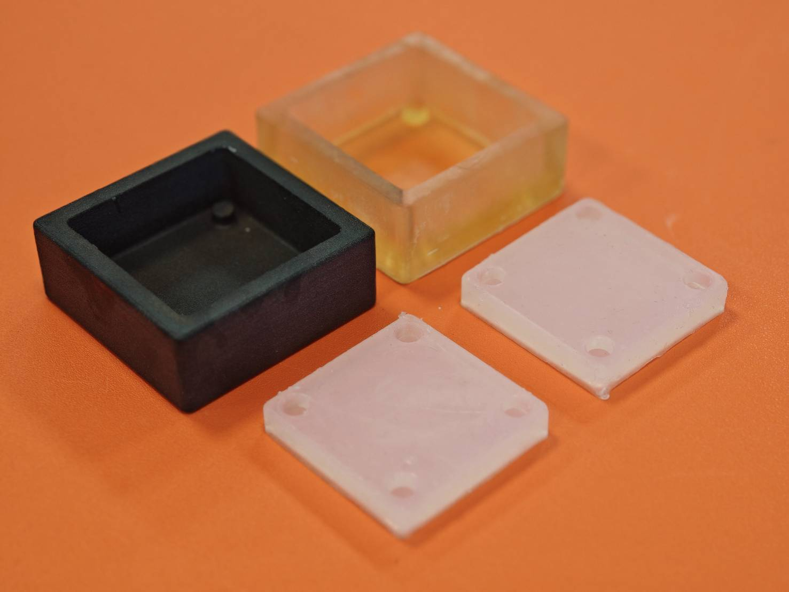

# 🧩 Rapid Silicone Mold with Digital Fabrication

  

This project presents a **rapid digital fabrication workflow** for creating silicone molds using **SLA 3D printing** and **computer-aided design (CAD)**. It demonstrates how **high-resolution photopolymer printing** can be integrated with **silicone casting** to achieve **fast, accurate, and repeatable mold production** — eliminating the need for traditional tooling. Starting from a CAD model and applying essential mold design principles—such as parting-line planning, draft-angle integration, and cavity generation—users can transition from digital design to a functional mold within hours. Using **Anycubic ABS-Like Pro 2** resin ensures **high dimensional stability** and **fine surface fidelity** while remaining compatible with standard **RTV platinum-cured silicones** when properly post-processed.
> 💡 Ideal for **small-scale manufacturing**, **product prototyping**, **research**, and **educational demonstrations** — bridging the gap between **additive manufacturing** and **mold-based fabrication**.
---

## 🧱 3D Modeling Workflow
1. **Create or import** the desired 3D model into your CAD workspace.  
2. **Generate a solid block** that fully encloses the model, ensuring sufficient wall thickness on all sides.  
3. **Use the `Combine` tool** with the **Cut** operation to subtract the model from the block, forming a **negative mold cavity**.  
4. **Export and 3D print** the resulting mold using your SLA printer.
🎥 **Reference Video:** [Rapid Mold 3D Modeling Workflow](https://youtu.be/Q1Thdrt40MA?si=13iyadsBUq4JawJu)

## 🧴 Silicone  
The silicone used here is **RTV platinum-cured**, which is **highly sensitive** to contaminants such as **uncured resin, sulfur, amines, and tin-based compounds**.  
Proper cleaning and post-curing of the SLA mold are essential to prevent curing inhibition.

---

## 🧰 Materials Used
| Type | Material | Description |
|------|-----------|-------------|
| **Mold Master** | [Anycubic ABS-Like Resin Pro 2 (Clear)](https://store.anycubic.com/products/abs-like-resin-pro-2?variant=43847439351970) | High-strength, clear SLA resin with ABS-like mechanical properties. Excellent for durable mold masters, but may inhibit silicone if not fully cured. |
| **Casting Silicone** | [RungArt Silicone 40AB (Platinum-Cure)](https://www.resinrungart.com/shop/1402225205854-yaangchiliokhn-ra-40ab-chud-1-kk-110012) | Room-temperature, platinum-cured RTV silicone (Shore A 40) — ideal for flexible, high-detail molds. |

---

## 🧪 Material Compatibility Notes
### 🖨️ SLA Resin  
SLA printing provides **high resolution** and **smooth surfaces**, ideal for mold masters.  
However, **uncured resin residue** can **inhibit platinum-cure silicones**, causing tacky or uncured surfaces.  
Ensure the print is **fully cleaned, UV-cured, and heat-treated** before casting.

---

## 🔧 Post-Processing Workflow

  

To ensure full curing and silicone compatibility:
1. 🧼 **Wash** the printed part twice in **99% isopropyl alcohol (IPA)**.  
2. 🧪 **Soak** in fresh IPA for **30 minutes** to dissolve trapped resin.  
3. 🌬️ **Air-dry** thoroughly to remove all solvent.  
4. 🔆 **UV-cure** under **405 nm light** for **1 hour**, rotating for even exposure.  
5. 🔥 **Bake** at **60 °C for 2 hours** to complete crosslinking.  
6. 🌿 **Rest** in open air for **at least 3 days** before casting silicone.
---

## ⚠️ Caution, Best Practices, and Troubleshooting
### 🧫 1. Incomplete SLA Curing May Inhibit Silicone  
**Issue:** Residual resin inhibits **platinum-cure silicone**, leaving tacky or partially cured areas.  
**Prevention:**  
- Wash thoroughly in ≥ 90 % IPA.  
- Let solvent fully evaporate before UV curing.  
- Post-cure under 405 nm UV for ≥ 1 h, rotating for uniform exposure.  
- Apply a **barrier coat** (clear acrylic or epoxy) if inhibition persists.
---

### 🧩 2. Mold Design Guidelines  
- **Draft Angles:** 2–3° minimum (5° + for deep cavities).  
- **Wall Thickness:** 5–10 mm for structural rigidity.  
- **Alignment Keys:** 6–12 mm hemispherical or diamond shapes for precision.  
- **Sprues & Vents:**  
  - Sprues: Ø 3–6 mm (low points).  
  - Vents: Ø 0.3–1 mm (high points).  
- **Fillets:** 0.5–1 mm internal radii to reduce stress.  
- **Surface Finish:** Smooth or seal masters; matte surfaces trap bubbles.
---

### ♨️ 3. Controlled Heat Use  
**Guideline:** Gentle heating (30–45 °C) shortens silicone curing but excessive heat can cause deformation.  
**Risks:**  
- **Resin warping** (ABS-Like Pro 2 softens > 60 °C).  
- **Silicone shrinkage or bubbles** from rapid exotherm.  
**Best Practice:**  
- Use a **drying oven or warm enclosure** below 45 °C.  
- Avoid direct heat guns or local heating.  
---

### 🧴 4. Handling and Storage  
- Store molds in a **cool, dry, dust-free** place.  
- Lightly dust with **talcum powder** to prevent tack.  
- Label molds with **date, silicone type, and cure settings**.  
- Avoid stacking molds to prevent deformation.
---

### 🧪 5. Troubleshooting Silicone Inhibition  
If silicone remains **tacky or incompletely cured**:  
- Rewash and re-UV-cure the SLA mold.  
- Allow **24–72 hours of air exposure** before recasting.  
- Resting the mold several days helps residual volatiles dissipate.  
- For persistent issues, test a **small patch** of silicone first.
---

## 📚 Reference
> Venzac, B., Deng, S., Mahmoud, Z., Lenferink, A., Costa, A., Bray, F., Otto, C., Rolando, C., & Le Gac, S. (2021). *PDMS Curing Inhibition on 3D-Printed Molds: Why? Also, How to Avoid It?* **Analytical Chemistry, 93**(19), 7180–7187. [https://doi.org/10.1021/acs.analchem.0c04944](https://doi.org/10.1021/acs.analchem.0c04944)

---
